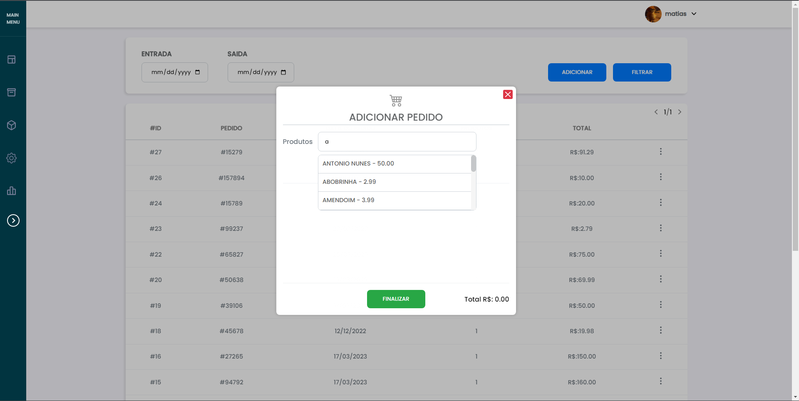
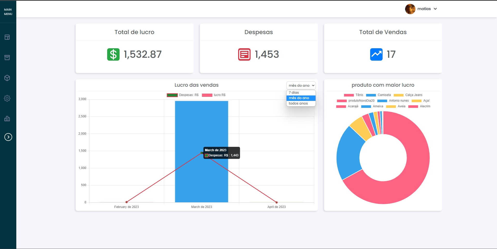
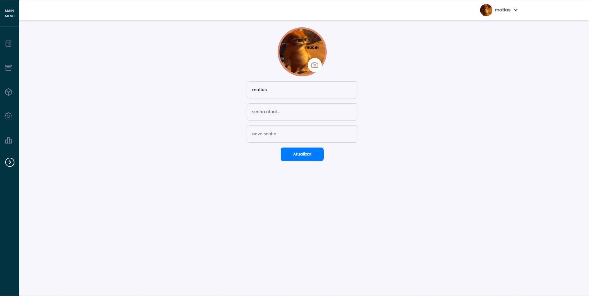
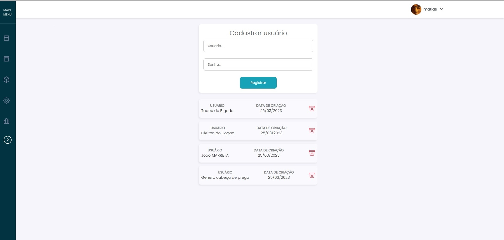

# SISTEMA - React JS
> Sistema para controle de fluxo de estoque

> ## SOBRE

### BACK-END:
- Linguagem do Back-end criada em NodeJS 
- Banco de dados MySQL
- Middleware para proteger cada end-point
- Criação de API com Express
- Senhas criptografadas no banco
- Criação e validação de JWT

### FRONT-END:
- Front end criado em ReactJS 
- Proteção com rotas privadas
- API consumido através do end-point fornecido pelo back-end
- Manipulação de JWT
- Validação de token para permanecer o usuário logado na página
- Notificações de Erro

## TELA DE PEDIDOS

Páginas disponíveis [ Vendas - Estoque - Produtos e Serviços ].
porem mostrei só essa por ser idênticas as outras.



- Os dados são consumidos através da API pelo front-end.

- A página de pedido tem filtro através da data, para que ela possa ter um controle maior.
## TELA DE ESTATÍSTICAS


- Baseado nas vendas o usuário poderá olhar no gráfico para saber se a sua receita está positiva ou negativa e podendo encontrar melhorias no seus ganhos

- Tem a parte de produtos mais vendidos baseado no valor, para que ela possa ver o que está dando mais retorno

- filtro de busca na qual você consegue ver as despesas e ganhos (As despesas são mostram mês ou ano), para ficar menos poluído

## TELA DE PERFIL


- A tela de perfil é simples somente para o usuário deixar de acordo com o que gosta

- As informações serão atualizada, somente se o usuário deixar a senha correta, para que tenha uma segurança maior

## TELA DE USUÁRIOS 


- A tela de usuário deixei somente para a pessoa registrada adicionar as outras, para evitar que alguém da própria rede se cadastre e tenha acesso aos dados.

- Para deletar, também existe uma verificação de Token, para que não aja comportamentos mal intencionados na rede interna.

## RODAR O PROJETO:

### Clone
```
$ git clone https://github.com/matiash26/Projeto-de-estoque-para-gerenciar-entradas-e-saidas
```

### Instalando as dependências
### Execução do React em ambiente de desenvolvimento
```
$ cd Dashboard/
$ npm i
$ npm run dev
```
#### Back-end
```
$ cd Backend/
$ npm i
$ npm run migration
$ npm start
```
